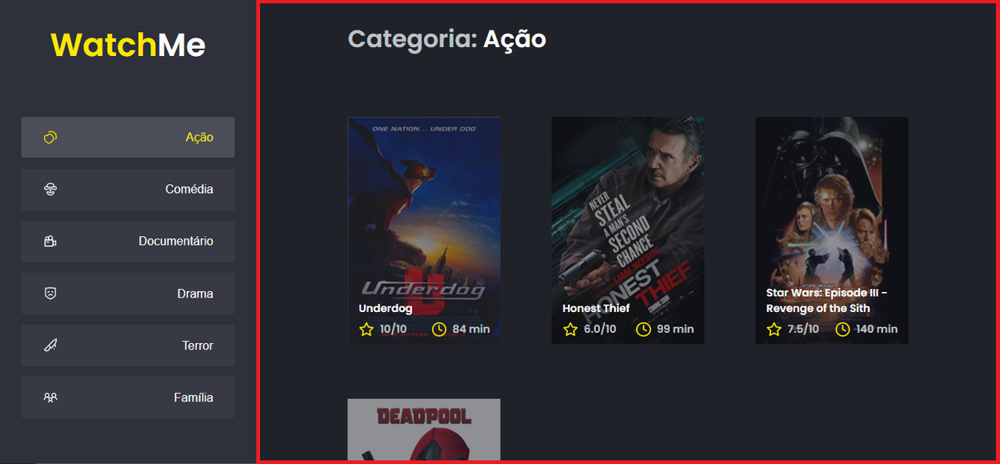
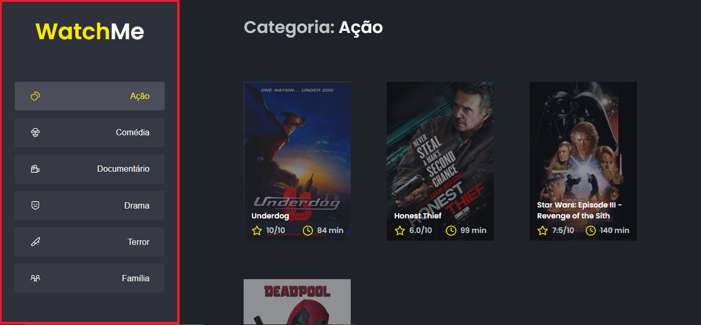
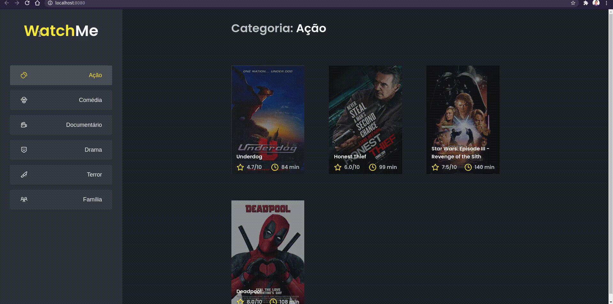

# Desafio 02 - Componentizando a aplicação

<div align="center">
    

Este desafio faz parte da lista de desafios que compõem o curso de NodeJS.

Visite à [Rockseat](https://rocketseat.com.br/) para saber mais sobre o curso.

</div>

<p align="center">
  

  <a href="https://rocketseat.com.br">
    
  </a>

  
  
</p>

<p align="center">
  <a href="#rocket-sobre-o-desafio">Sobre o desafio</a>&nbsp;&nbsp;&nbsp;|&nbsp;&nbsp;&nbsp;
  <a href="#keyboard-instalação-e-execução-do-projeto">Instalação e Execução do Projeto</a>&nbsp;&nbsp;&nbsp;|&nbsp;&nbsp;&nbsp;
  <a href="#template-da-aplicação">Template da aplicação</a>&nbsp;&nbsp;&nbsp;|&nbsp;&nbsp;&nbsp;
  <a href="#instruções">Instruções</a>&nbsp;&nbsp;&nbsp;|&nbsp;&nbsp;&nbsp;
  <a href="#memo-licença">Licença</a>
</p>

## :rocket: Sobre o desafio

O principal objetivo deste desafio é refatorar uma página para listagem de filmes de acordo com gênero.

A aplicação já está totalmente funcional mas grande parte do seu código está diretamente no arquivo `App.tsx`. Para resolver isso da melhor forma, é necessário dividir a aplicação em **pelo menos** duas partes principais: sidebar e o conteúdo principal que possui o header e a listagem de filmes.

- A aplicação possui apenas uma funcionalidade principal que é a listagem de filmes;
- Na sidebar é possível selecionar qual categoria de filmes deve ser listada;
- A primeira categoria da lista (que é "Ação") já deve começar como marcada;
- O header da aplicação possui apenas o nome da categoria selecionada que deve mudar dinamicamente.

A seguir veremos com mais detalhes o que e como precisa ser feito 🚀

### :keyboard: Instalação e Execução do Projeto

- Clone o repositório

```
https://github.com/code36u4r60/ignite-desafio-componentizando-a-aplicacao.git
```

ou

```
git@github.com:code36u4r60/ignite-desafio-componentizando-a-aplicacao.git
```

ou

```
gh repo clone code36u4r60/ignite-desafio-componentizando-a-aplicacao
```

- Entrar na pasta do projeto

```
cd ignite-desafio-componentizando-a-aplicacao
```

- Instale as dependências com o Yarn

```
yarn
```

- Inicie o Servidor

```
yarn server
```

- Executar o projeto

```
yarn dev
```

### Template da aplicação

Foi utilizado um modelo de template que possui o esqueleto do projeto.

O template está disponível na seguinte URL:

[](https://github.com/rocketseat-education/ignite-template-componentizando-a-aplicacao)

**Dica**: Caso não saiba utilizar repositórios do GitHub como template, temos um guia em **[nosso FAQ](https://www.notion.so/FAQ-Desafios-ddd8fcdf2339436a816a0d9e45767664).**

## Instruções

### Fake API com JSON Server

Para esse desafio vamos usar uma Fake API com JSON Server, para simular uma API que possui as informações de gêneros e filmes.

Navegue até a pasta criada, abra no Visual Studio Code e execute os seguintes comandos no terminal:

```bash
yarn
yarn server
```

DO que vai obter vai ser algo assim:

```bash

➜  ignite-desafio-componentizando-a-aplicacao git:(main) ✗ yarn server
yarn run v1.22.5
$ json-server server.json --port 3333

  \{^_^}/ hi!

  Loading server.json
  Done

  Resources
  http://localhost:3333/genres
  http://localhost:3333/movies

  Home
  http://localhost:3333

  Type s + enter at any time to create a snapshot of the database

```

Perceba que ele iniciou uma fake API com os recursos `/genres` e `/movies` em `localhost` na porta `3333` a partir das informações do arquivo [server.json](https://github.com/rocketseat-education/ignite-template-componentizando-a-aplicacao/blob/main/server.json) localizado na raiz do seu projeto.

Dessa forma, basta consumir essas rotas da API normalmente com o Axios. Caso queira estudar mais sobre o **JSON Server**, dê uma olhada aqui:

[typicode/json-server](https://github.com/typicode/json-server)

## O que devo editar na aplicação?

Com o template já clonado, as dependências instaladas e a [fake API rodando](https://www.notion.so/Desafio-01-Criando-um-hook-de-carrinho-de-compras-5769216778794019a83f544e79167b12), você deve criar **pelo menos** os componentes SideBar e Content que já estão com os arquivos criados.
Os arquivos a serem editados são:

- **src/App.tsx**

  Esse componente contém toda a aplicação com exceção do componente `Button` que não precisa ser alterado e `Icon` que também não precisa de alteração.

- **src/components/Content.tsx**

  Esse componente, ainda vazio, deve possuir toda a lógica e corpo responsável pelo header e conteúdo da aplicação (seção contornada em vermelho):

<p align="center">
    
</p>

- **src/components/SideBar.tsx**

Esse componente, também vazio, deve possuir toda a lógica e corpo responsável pela seção que contém o título do site e a parte de navegação à esquerda da página (seção contornada em vermelho):

<p align="center">
    
</p>

Se você preferir, pode também componentizar algumas outras partes da aplicação como, por exemplo, o header, mas esse não está como requisito deste desafio 🚀

## Resultado final da aplicação

<p align="center" style="margin-bottom: 4rem">
    
</p>

## :memo: Licença

Esse projeto está sob a licença MIT. Veja o arquivo [LICENSE](https://github.com/git/git-scm.com/blob/master/MIT-LICENSE.txt) para mais detalhes.

---

Created with 💜 by <a href="https://www.linkedin.com/in/eduardoqueiros/">Eduardo Queirós</a> :wave:
